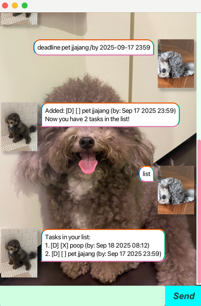

# Juin User Guide



Welcome to Juin! Juin is named after my friend Juin and will keep track of all your tasks

Juin can track your todos, deadlines and events with a simple text based interface

With Juin you can:
- Add, delete, view and mark tasks as done
- Track deadlines and events
- Search and filter tasks

## Adding todos

Add any todo by typing:

```
todo DESCRIPTION
```

Example: `todo pet jjajang`

// A description of the expected outcome goes here

```
Added: [T] [ ] pet jjajang
Now you have 2 tasks in the list!
```

## Adding deadlines

Add any deadline by typing:

```
deadline DESCRIPTION /by DATE
```

Example: `deadline pet jjajang /by 2025-09-12`


```
Added: [D] [ ] pet jjajang (by: Sep 12 2025)
Now you have 3 tasks in the list!
```


## Adding events

Add any event by typing:

```
event DESCRIPTION /from DATE /to DATE
```

Example: `event pet jjajang /from 2025-09-12 0000 /to 2100-09-12 2359`


```
Added: [E] [ ] pet jjajang (from: Sep 12 2025 00:00 to: Sep 12 2100 23:59)
Now you have 6 tasks in the list!
```

## List

List tasks by typing:

```
list
```

Example: `list`


```
Tasks in your list:
1. [D] [X] poop (by: Sep 18 2025 08:12)
2. [D] [ ] pet jjajang (by: Sep 17 2025 23:59)
3. [D] [ ] pet jajjang (by: Sep 12 2025)
4. [T] [ ] poop
5. [E] [ ] pet jjajang (from: Sep 12 2025 00:00 to: Sep 12 2030 23:59)
```

## Mark

Mark tasks by typing:

```
mark INDEX
```

Example: `mark 3`


```
Marked as done: [D] [X] pet jajjang (by: Sep 12 2025)
```

# Unmark
Unmark tasks by typing:

```
unmark INDEX
```

Example: `unmark 3`


```
Marked as not done: [D] [ ] pet jajjang (by: Sep 12 2025)
```

# Delete
Delete tasks by typing:

```
delete INDEX
```

Example: `delete 3`


```
Removed: [D] [ ] pet jajjang (by: Sep 12 2025)
Now you have 4 tasks in the list!
```